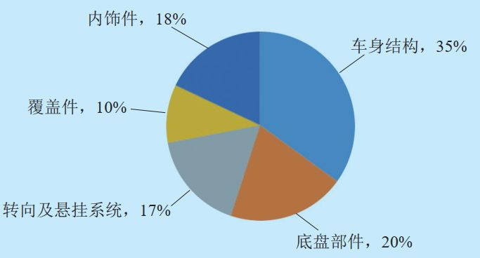
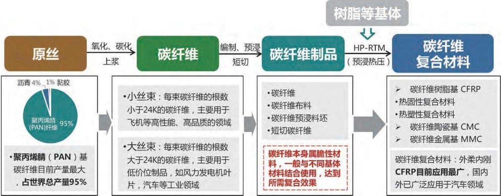

# CFRP在汽车上的应用

## **一、碳纤维复合材料简介**

含碳量在 95% 以上的高强度、高模量新型纤维材料

特点：

- 无蠕变

- 耐高温

- 耐腐蚀

- 耐疲劳

- 热膨胀系数小

**汽车用碳纤维复合材料通常以树脂基碳纤维增强复合材料（CFRP）为主**

## **二、碳纤维材料应用于汽车上的优势**

目前用于汽车上的材料主要是高强度钢、铝合金、镁合金、钛合金、玻璃纤维复合材料、碳纤维复合材料等，这些材料的性能对比如下。碳纤维复合材料在轻量化、安全性、舒适性、可靠性、提升车身开发水平等方面具有巨大优势。

<table>
  <caption>表1 各类汽车轻量化材料力学特性对比</caption>
  <thead>
    <tr><th colspan="2">材料种类</th><th>密度(g/cm3)</th><th>抗拉强度/MPa</th><th>弹性模量MPa</th><th>比强度</th><th>比模量</th><th>耐腐蚀性</th></tr>
  </thead>
  <tbody>
    <tr><td colspan="2">高强度钢</td><td>7.8</td><td>1000</td><td>214000</td><td>1.3</td><td>0.27</td><td>一般</td></tr>
    <tr><td colspan="2">铝合金</td><td>2.8</td><td>420</td><td>71000</td><td>1.5</td><td>0.25</td><td>较强</td></tr>
    <tr><td colspan="2">镁合金</td><td>1.79</td><td>280</td><td>45000</td><td>1.6</td><td>0.25</td><td>差</td></tr>
    <tr><td colspan="2">钛合金</td><td>4.5</td><td>942</td><td>112000</td><td>2.1</td><td>0.25</td><td>强</td></tr>
    <tr><td colspan="2">玻璃纤维复合材料</td><td>2.0</td><td>1100</td><td>40000</td><td>5.5</td><td>0.2</td><td>强</td></tr>
    <tr><td rowspan="2">碳纤维复合材料</td><td>高强度型</td><td>1.5</td><td>1400</td><td>130000</td><td>9.3</td><td>0.87</td><td>非常强</td></tr>
    <tr><td>低强度型</td><td>1.6</td><td>1100</td><td>190000</td><td>6.2</td><td>1.2</td><td>非常强</td></tr>
  </tbody>
</table>

1. **轻量化**

碳纤维应用于汽车后，给汽车制造带来最明显的好处就是汽车轻量化，最直接影响的就是节能、加速、制动性能的提升。一般而言，**车重减小10％，油耗降低6％～8％，排放降低5～6%, 0-100km/h加速性提升8-10%，制动距离缩短2～7m**。

2. **安全性**

车身轻量化可以使整车的重心下移，提升了汽车操纵稳定性，车辆的运行将更加安全、稳定。碳纤维复合材料具有极佳的能量吸收率，碰撞吸能能力是钢的六到七倍、铝的三到四倍，这进一步保证了汽车的安全性。

3. **舒适度**

碳纤维复合材料具有更高的震动阻尼，轻合金需要9秒才能停止震动，碳纤维复合材料2秒就能停止，故碳纤维应用在汽车上，对于整车NVH（噪声、振动与声振粗糙度）的提升贡献同样很大，会大幅增强汽车行驶的舒适性。

4. **可靠性**

碳纤维复合材料具有更高的疲劳强度，钢和铝的疲劳强度是抗拉强度的30-50%，而碳纤维复合材料可达70-80%，因此汽车上应用碳纤维复合材料对于材料疲劳可靠性有较大提升。

5. **提升车身开发水平**

由于碳纤维复合材料可设计性比金属强，因此更易于车身开发的平台化、模块化、集成化。这样碳纤维车身及金属平台的混合车身结构对于传统汽车车身结构而言，可以做到模块化、集成化，大大减少零件种类，减少工装投入，缩短开发周期。

## **三、碳纤维复合材料在汽车上的应用部位**

目前，碳纤维复合材料已经在车身构件、刹车片、轮毂、传动轴等领域得到应用。

**1、车身构件**

车身构件是目前碳纤维复合材料在汽车上运用最多的地方，诸如引擎盖、车架、车顶框架及加强筋、 A/B/C/D 立柱及车门、扰流板等构件均已有 CFRP 的身影。通用汽车公司1992年就已将CFRP用于超轻概念车的车身和底盘结构件，采用手工铺碳纤维预浸料成型工艺，整体车身质量减重68%，节约油耗40%。

**2、刹车片**

CFRP 具有很多优良特性，如：①有合适并且稳定的摩擦系数（0.35 ~0.40），制动过程平稳；②耐湿热，不易老化，耐热温度高达 2500℃，且不存在传统金属材料的热损耗问题；③耐油、耐水、耐腐蚀等，因此是制造刹车片理想的材料，被大量应用于F1和GT系列赛车的刹车片领域。西格里公司生产的碳纤维—陶瓷制动盘装置，应用于PorscheAG、 911Turbo GT和GT IIS车型。

**3、轮毂**

轮毂是汽车行驶的重要部件之一，它不仅承受整车的重量与载重，更承担着传递驱动和扭矩。所以车用轮毂不仅要拥有较高的抗冲击性，还要具有较好的耐久性、耐热性和安全性。碳纤维复合材料轮毂不仅可以满足车用轮毂的所有要求，在车辆轻量化方面更是表现出色。英国Kahm公司使用 CFRP 制得的 RX–X 型高级汽车专用轮毂，重量仅为6 kg，可高速行驶，并可最大限度地降低车轮的径向惯性力；瑞典Koenigsegg公司2013款Agera R型跑车搭载的世界上第一个中空、一片式碳纤维轮毂，在降低约20 kg的簧下重量的同时，依然可保证良好的安全和抗冲击性能。

**4、传动轴**

碳纤维增强复合材料所具备的各向异性、高的比强度和比模量的特点，在传动轴产品上得以充分发挥。与普通钢材相比，重量可以减轻一半以上。在同等重量和直径的条件下，扭矩力可以达到钢材的170%以上。另外，碳纤维传动轴在有效降低传动轴重量的情况下，将拥有更好的耐疲劳性和耐久性。丰田公司开发的TheDriveshaft Shop碳纤传动轴不仅重量减少了一半，且传动效率更快。英国GNK公司研发了碳纤维传动轴广泛应用于Audi A4等车型；日本东丽公司生产的碳纤维汽车传动轴广泛应用于阿斯顿马丁、马自达、越野、奔驰等车型。

碳纤维复合材料在汽车中的潜在应用比例

## **四、碳纤维复合材料产业链**

## **五、碳纤维复合材料在汽车上的应用进展**

碳纤维复合材料不仅具有极好的轻量化效果,优秀的力学性能也让其具有广泛的应用范围,能够适应多种汽车零部件的使用工况。

近年来,CFRP被广泛应用于汽车核心零部件的生产制造,在车身底盘方面,通用超轻概念车采用碳纤维车身和底盘实现减重68%,斯巴鲁 WRX STItS采用CFRP车顶,相比高强度钢车顶减重80%。在制动盘方面,Porsche AG等车采用碳纤维制动盘,实现在50m内将车速从300km/h降到50km/h。在传动轴方面,丰田86采用的碳纤维传动轴仅重5.53kg,实现减重50%。日本近年来研发出用碳纤维代替铝合金制造压气机叶轮,有效缩短了响应滞后,实现减重48%。

在全球各大汽车厂商中,宝马率先实现碳纤维在量产车上的突破性应用,开创了车用碳纤维新时代。宝马通过与西格里、三菱丽阳等碳纤维企业进行深度合作,凭借分布在三国五地的生产链条,率先实现大量使用碳纤维制造的汽车成本最低化。从i3、i8到新7系,宝马不断探索采用碳纤维车身并实现量产。每辆宝马i3约使用200-300kg碳纤维复合材料,减重250-350kg,整车重量仅1224kg。同时,碳纤维车身较轻的重量大幅度提升了车辆性能和续航里程,节省电池成本约1299美元。宝马i3、i8以及新7系的量产,充分证明了碳纤维在汽车行业大规模量产应用上的可行性。但由于目前碳纤维成本仍然很高,汽车厂商在应用碳纤维时还需要充分考虑车型议价能力。

<table>
  <caption>表2 国外汽车生产商CFRP应用情况</caption>
  <thead>
    <tr><th>生产商</th><th>国家</th><th>车型</th><th>零部件</th><th>减重效果</th></tr>
  </thead>
  <tbody>
    <tr><td>宝马</td><td>德国</td><td>宝马7系</td><td>车身结构</td><td>减重230kg</td></tr>
    <tr><td>通用</td><td>美国</td><td>概念车</td><td>车身底盘</td><td>减重68%</td></tr>
    <tr><td>丰田</td><td>日本</td><td>丰田86</td><td>传动轴</td><td>减重50%</td></tr>
    <tr><td>富士重工</td><td>日本</td><td>斯巴鲁WRX STltS</td><td>车顶</td><td>较原钢板减重80%</td></tr>
    <tr><td>福特</td><td>美国</td><td>野马Shelby GT350R</td><td>轮毂</td><td>较原铝合金制件减重43%</td></tr>
    <tr><td>福特</td><td>美国</td><td>FalconXR6 Sprint</td><td>进气管</td><td>较原塑料件减重46%</td></tr>
    <tr><td>兰博基尼</td><td>意大利</td><td>第六元素概念车</td><td>连杆</td><td>较原钢制件减重40%～50%</td></tr>
    <tr><td>克莱斯勒</td><td>美国</td><td>道奇蝰蛇</td><td>发动机罩</td><td></td></tr>
  </tbody>
</table>

国内厂商如奇瑞等,也在车用碳纤维领域相继实现突破。奇瑞与中科院合作研发的艾瑞泽7通过复合材料体系、结构件设计、快速成型工艺的研究，及材料结构件性能验证与评估，实现了碳纤维复合材料的大量应用，并得到良好的轻量化效果和整车性能。

<table>
  <caption>表3 艾瑞泽7碳纤维应用及效果</caption>
  <thead>
    <tr><th>部件</th><th>金属件/kg</th><th>CFRP/kg</th><th>减重比例</th></tr>
  </thead>
  <tbody>
    <tr><td>前保险杠横梁</td><td>3.66</td><td>1.88</td><td>49%</td></tr>
    <tr><td>吸能盒</td><td>1.75</td><td>0.65</td><td>63%</td></tr>
    <tr><td>散热器横梁</td><td>1.69</td><td>0.638</td><td>62%</td></tr>
    <tr><td>制动踏板</td><td>1.3</td><td>0.676</td><td>48%</td></tr>
    <tr><td>传动轴</td><td>9.6</td><td>3.57</td><td>63%</td></tr>
    <tr><td>前底板</td><td>24</td><td>13.3</td><td>65%</td></tr>
    <tr><td>后门盖外板</td><td>3.49</td><td>1.71</td><td>51%</td></tr>
    <tr><td>车身侧围外板</td><td>9.1</td><td>4.2</td><td>54%</td></tr>
  </tbody>
</table>

## **六、碳纤维复合材料产业化面临的问题**

**1、降低碳纤维价格，提高CFRP竞争力。**  

从原材料角度看，美国岩石山研究所曾经对汽车工业应用的碳纤维进行分析研究得出：当碳纤维价格降至16.5美元/kg以下时，碳纤维与钢材相比具有较强竞争力。降低碳纤维价格的途径之一是应用低成本的大丝束碳纤维，其售价只有小丝束碳纤维的50%~60%。

**2、改进加工工艺，提高生产效率，适应量化生产。**

现有的碳纤维复合材料制造技术，大多存在生产效率低的问题，难以满足当下汽车工业高生产节奏的严苛要求。研发新型加工工艺，缩短成型周期是未来必须解决的一个难题。

**3、提高CFRP性能稳定，保证零部件质量一致性。**

复合材料产品的质量一致性与原材料以及工艺过程各环节的变异性相关。固化工艺并通过严格控制工艺过程以实现各工艺环节的高度重复性、选取优化的工艺参数、全过程高度自动化等方式，有效控制产品质量的一致性。
